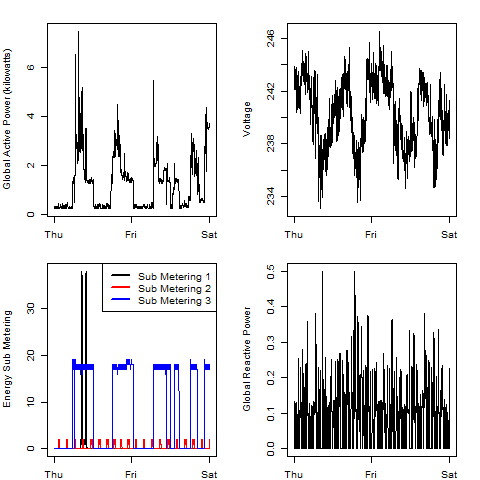

## Introduction

This project uses data from the <a href="http://archive.ics.uci.edu/ml/">UC Irvine Machine Learning Repository</a>, a popular repository for machine learning datasets. In particular, we will be using the "Individual household electric power consumption Data Set" which may be downloaded from:

* <b>Dataset</b>: <a href="https://d396qusza40orc.cloudfront.net/exdata%2Fdata%2Fhousehold_power_consumption.zip">Electric power consumption</a> [20Mb]

* <b>Description</b>: Dataset includes measurements of one household's electric power consumption, sampled once a minute over a period of almost 4 years. Different electrical quantities and some sub-metering values are available.

* <b>GitHub:</b>: The following GitHub repository was forked and cloned:  [https://github.com/rdpeng/ExData_Plotting1](https://github.com/rdpeng/ExData_Plotting1)

## Loading the data

The original dataset has 2,075,259 rows and 9 columns. A rough estimate of how much memory the dataset will require to load the entire dataset into memory on the local machine is:

(2,075,259 rows) * (9 columns) * (8 bytes/entry) = approx. 149 Mbyte.

This is not a conservative figure, as it will have to load into contiguous RAM, but the author's local machine has 16 Gbyte of RAM, so no problems are expected.  If the user's machine has only 4 Gbyte of RAM some applications may need to be closed before the load is attempted.  If memory has been allocated to previous R simulations, the user may need to run R's garbage collection [ by executing gc() ].  This does not repack memory, and since the file will need to be loaded into contiguous RAM, the user may need to restart R.

* This analysis will consider data for the two day range 2007-02-01 and 2007-02-02, so only these observations are read into the `tbl` dataframe.

* The original dataset contains missing values coded as `?`, but no missing values are found in the date range of interest, so no conversion is performed.

* After the two day observations are read into a dataframe, the Date and Time variables are concatenated, converted to a POSIX format, then merged into the `tbl` dataframe as the `DT` variable.

* The following ten variables are included in the dataset referenced by `tbl`:

<ol>
<li><b>Date</b>: Date in format dd/mm/yyyy </li>
<li><b>Time</b>: time in format hh:mm:ss </li>
<li><b>Global Active Power</b>: household global minute-averaged active power (in kilowatt) </li>
<li><b>Global Reactive Power</b>: household global minute-averaged reactive power (in kilowatt) </li>
<li><b>Voltage</b>: minute-averaged voltage (in volt) </li>
<li><b>Global Intensity</b>: household global minute-averaged current intensity (in ampere) </li>
<li><b>Sub Metering 1</b>: energy sub-metering No. 1 (in watt-hour of active energy). It corresponds to the kitchen, containing mainly a dishwasher, an oven and a microwave (hot plates are not electric but gas powered). </li>
<li><b>Sub Metering 2</b>: energy sub-metering No. 2 (in watt-hour of active energy). It corresponds to the laundry room, containing a washing-machine, a tumble-drier, a refrigerator and a light. </li>
<li><b>Sub Metering 3</b>: energy sub-metering No. 3 (in watt-hour of active energy). It corresponds to an electric water-heater and an air-conditioner.</li>
<li><b>DT</b>: Concatenation of Date and Time variables, converted to a POSIX format.  This variable not in original dataset.</li>
</ol>

## Plot Summary

* This report will examine how household energy usage varies over a 2-day period in February, 2007, using R's base plotting system.  Four plots will be created:  `plot1.png`, `plot2.png`, `plot3.png`, `plot4.png`.

* Each plot will be generated by corresponding scripts and saved as a PNG graphic with 480 X 480 pixel resolution.

* Corresponding R scripts: `plot1.R` constructs `plot1.png` plot, and so on.  Each script will provide for reading in the source .zip archive from the URL listed at the top of this README, and converting it to a semicolon delimited text file.  This download step is bypassed if that text file is already present due to a prior download.

The four plots are shown below. 

### Plot 1

`Global Active Power` frequency distribution.

 

### Plot 2

`Global Active Power` as a function of time.

 

### Plot 3

`Sub Metering x` as a function of time for all three Sub Metering variables.

 

### Plot 4

Composite of Plots 2 and 3 plus `Voltage` and `Global Reactive Power`as a function of time.

